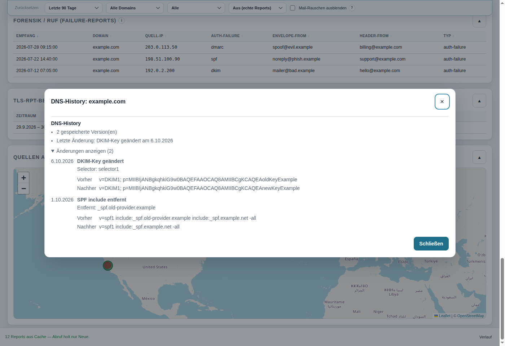
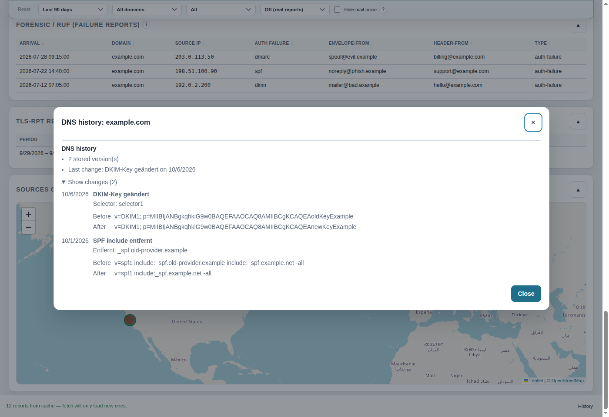

# Changelog

## Unreleased — changes since v1.0.42

### English

- Added permanent per-domain DNS and transport history, recording snapshots and detecting DMARC, SPF, DKIM, BIMI, TLS-RPT, and MTA-STS changes.
- Added automatic daily DNS and transport checks for domains found in saved DMARC reports. Existing recent checks are reused, and failures are logged and reported.
- Added a per-domain info button in the domain health list to open DNS history, including event dates and before/after values. The history is also available from the DNS check view.
- Refined report correlations to reflect the latest DNS drift and the latest DMARC report, avoiding stale alerts when the fail rate has recovered.
- Updated vulnerable transitive development dependencies: `http-cache-semantics` to 4.3.0 and `source-map-js` to 1.2.2; overrode `roarr` to 3.1.3 to remove vulnerable `sprintf-js`.

### Deutsch

- Dauerhafte DNS- und Transport-History pro Domain ergänzt. DNS-Snapshots werden gespeichert; Änderungen an DMARC, SPF, DKIM, BIMI, TLS-RPT und MTA-STS werden erkannt.
- DNS- und Transport-Checks laufen automatisch täglich für Domains aus gespeicherten DMARC-Reports. Kürzlich geprüfte Domains werden übersprungen; Fehler werden protokolliert und gemeldet.
- Ein Info-Button an jeder Domain in der Domain-Ampel öffnet die DNS-History mit Änderungsdatum sowie Vorher-/Nachher-Werten. Die Historie bleibt auch in der DNS-Check-Ansicht verfügbar.
- Korrelationen berücksichtigen jetzt den letzten DNS-Drift und den neuesten DMARC-Report. So werden überholte Hinweise ausgeblendet, wenn sich die Fail-Rate inzwischen erholt hat.
- Verwundbare transitive Entwicklungs-Abhängigkeiten aktualisiert: `http-cache-semantics` auf 4.3.0 und `source-map-js` auf 1.2.2; `roarr` wird auf 3.1.3 festgelegt und entfernt damit die verwundbare Abhängigkeit `sprintf-js`.

