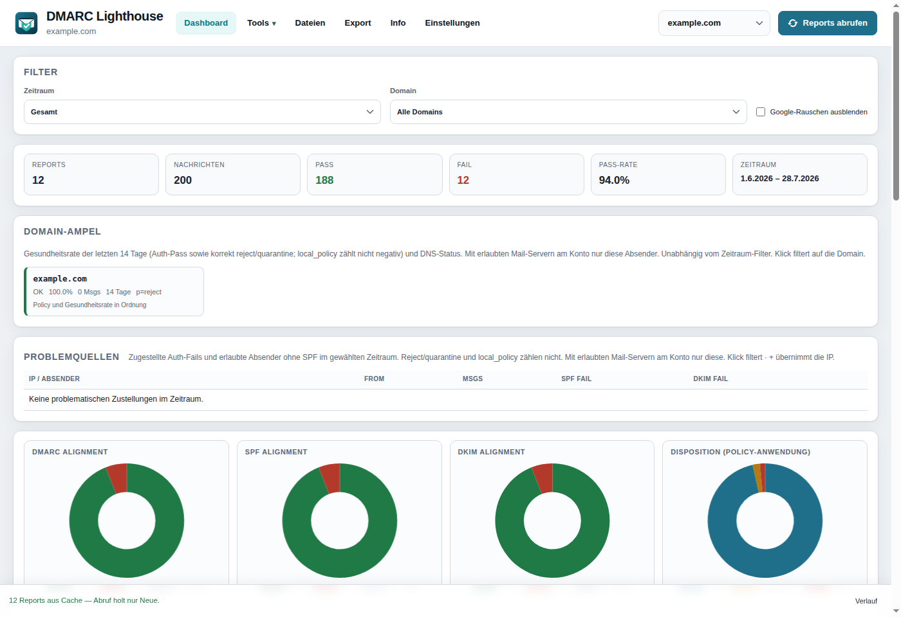
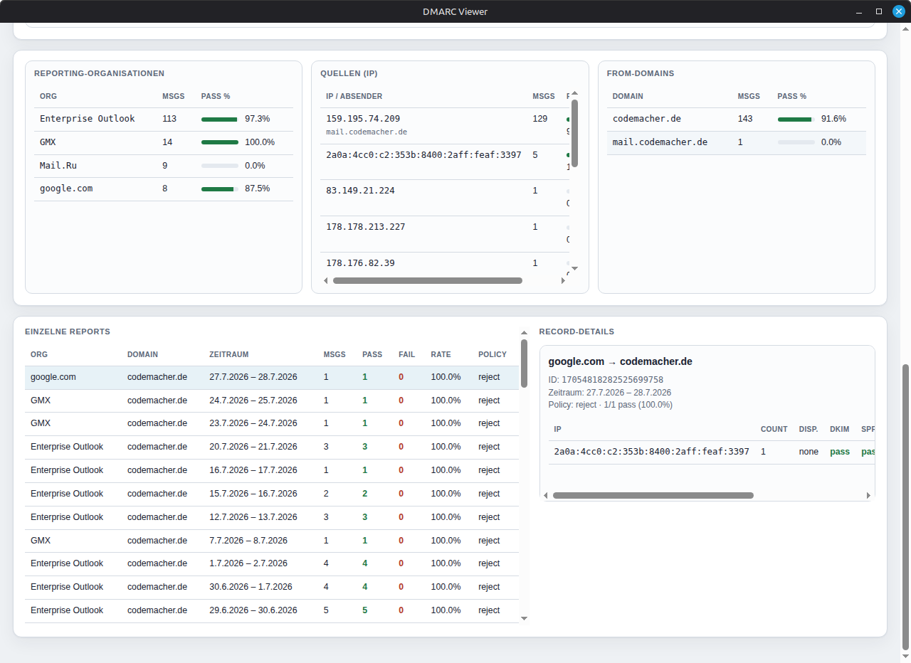
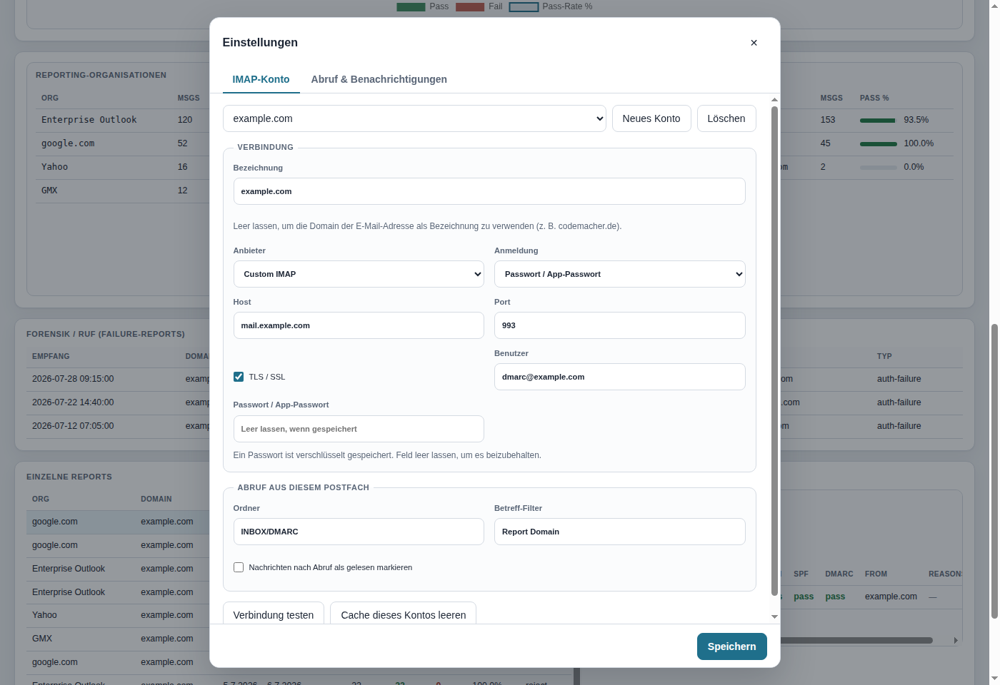

<p align="center">
  
</p>

<h1 align="center">DMARC Viewer</h1>

<p align="center">
  <a href="./README.md">English</a> ·
  <a href="./README.de.md">Deutsch</a>
</p>

<p align="center">
  Desktop-App zum Abrufen, Einlesen und Auswerten von DMARC-Aggregate-Reports.<br />
  IMAP-Postfach oder lokale Dateien → KPIs, Alignment-Charts und Detailtabellen.
</p>

<p align="center">
  <a href="https://github.com/codemacherUG/dmarcviewer/releases/latest"></a>
  <a href="https://github.com/codemacherUG/dmarcviewer/releases"></a>
  
  
</p>

<p align="center">
  <a href="#funktionen">Funktionen</a> ·
  <a href="#screenshots">Screenshots</a> ·
  <a href="#download--installation">Download</a> ·
  <a href="#nutzung">Nutzung</a> ·
  <a href="#entwicklung">Entwicklung</a>
</p>

---

## Was macht die App?

DMARC-Aggregate-Reports (RUA) landen oft als XML/ZIP/GZ in einem eigenen Postfach und sind schwer lesbar. **DMARC Viewer** holt diese Mails per IMAP (oder per Datei-Import), parst sie lokal und zeigt auf einen Blick:

- wie viele Nachrichten **Pass** bzw. **Fail** hatten
- ob **DMARC-, SPF- und DKIM-Alignment** stimmen
- welche **Quellen (IPs)**, **From-Domains** und **Reporting-Organisationen** auffällig sind
- wie sich Volumen und Pass-Rate **über die Zeit** entwickeln

Alles läuft lokal auf dem Rechner: Zugangsdaten bleiben im Electron-`userData`-Ordner, das Passwort wird mit `safeStorage` verschlüsselt. Es gibt keinen Cloud-Account und keine Telemetrie.

> **Hinweis:** Ausgewertet werden Aggregate-/RUA-Reports. Failure-/Forensik-Reports (RUF) werden nicht verarbeitet.

---

## Screenshots

### Dashboard

Kennzahlen, Alignment-Charts, Zeitreihe sowie integrierter DNS-Check für DMARC- und SPF-Records:



### Aggregation & Details

Reporting-Organisationen, Quell-IPs (inkl. Reverse-DNS), From-Domains, einzelne Reports und Record-Details:



### Einstellungen

IMAP-Zugang (Gmail, Outlook/Microsoft 365 oder Custom), Ordner, Betreff-Filter, Auto-Abruf und Benachrichtigungen:



---

## Funktionen

| Bereich | Details |
| --- | --- |
| **IMAP-Abruf** | Gmail, Outlook/Microsoft 365 oder beliebiger IMAP-Server; inkrementell über UIDs |
| **Datei-Import** | XML, GZ, ZIP, EML/MIME — Dialog oder Drag & Drop |
| **Lokaler Cache** | Geparste Reports bleiben erhalten; erneuter Abruf lädt nur neue Nachrichten |
| **Dashboard** | Reports, Nachrichten, Pass/Fail, Pass-Rate, Zeitraum |
| **Charts** | Doughnut für DMARC-/SPF-/DKIM-Alignment; Volumen & Pass-Rate über Zeit |
| **Tabellen** | Organisationen, Quell-IPs, From-Domains, einzelne Reports + Record-Details |
| **IP-Anreicherung** | Reverse-DNS und Erkennung bekannter Absender (Google, Microsoft, Amazon SES, …) |
| **Filter** | Zeitraum (7 / 30 / 90 Tage / Gesamt) und Domain |
| **DNS-Check** | Live-Abfrage von DMARC (`p`, `rua`) und SPF |
| **Export** | Aktuell gefilterte Daten als CSV oder JSON |
| **Auto-Abruf** | Optionales Intervall + Desktop-Benachrichtigung bei steigenden Failures |
| **Auto-Update** | Prüfung auf GitHub Releases (NSIS, AppImage, macOS-ZIP) |

---

## Download & Installation

Fertige Builds liegen unter den [GitHub Releases](https://github.com/codemacherUG/dmarcviewer/releases/latest):

| Plattform | Pakete |
| --- | --- |
| **Windows** | NSIS-Installer, portable EXE |
| **Linux** | AppImage, `.deb` |
| **macOS** | DMG und ZIP (x64 / arm64) |

Auto-Update greift in gepackten Builds (nicht im Dev-Modus). Portable-EXE und `.deb` werden nicht automatisch aktualisiert — NSIS-Setup, AppImage und macOS-ZIP schon.

---

## Voraussetzungen

- Für den Quellcode-Build: **Node.js 20+**
- Für Gmail / Outlook: **App-Passwort** (nicht das normale Kontopasswort)

### App-Passwörter & IMAP

| Anbieter | Host | Port | Hinweis |
| --- | --- | --- | --- |
| **Gmail** | `imap.gmail.com` | `993` (TLS) | Google-Konto → Sicherheit → 2-Schritt-Bestätigung → App-Passwörter |
| **Outlook / Microsoft 365** | `outlook.office365.com` | `993` (TLS) | App-Passwort bzw. IMAP freigeben, sofern der Tenant es erlaubt |
| **Custom** | beliebig | z. B. `993` | Benutzer/Passwort; TLS empfohlen |

Native Gmail-API- / Microsoft-Graph-OAuth sind nicht enthalten — IMAP deckt die gängigen Anbieter ab.

---

## Nutzung

1. **Einstellungen** öffnen, Anbieter/Host/Benutzer/App-Passwort setzen und speichern.
2. Optional **Verbindung testen**.
3. Im Hauptfenster **Reports abrufen** — oder XML/GZ/ZIP/EML per **Dateien öffnen** / Drag & Drop laden.
4. Mit Zeitraum- und Domain-Filter eingrenzen, Charts und Tabellen prüfen, bei Bedarf exportieren.
5. Domains im **DNS-Check** gegenprüfen (Policy `p`, Reporting-URI `rua`, SPF).

### Typischer Ablauf

```text
IMAP-Postfach / lokale Dateien
        │
        ▼
  Parsen (XML / GZ / ZIP / EML)
        │
        ▼
  Lokaler Cache (userData)
        │
        ▼
  Analyse → KPIs, Charts, Tabellen
        │
        ├── Filter (Zeitraum, Domain)
        ├── DNS-Check
        └── Export (CSV / JSON)
```

---

## Entwicklung

```bash
npm install
npm run dev
```

Produktion lokal:

```bash
npm run build
npm start
```

Plattform-Pakete:

```bash
npm run build:linux   # AppImage + deb
npm run build:win     # NSIS + portable
npm run build:mac     # DMG/ZIP (nur auf macOS)
```

GitHub Release (alle Plattformen via Actions): Tag wie `v1.0.5` pushen oder Workflow **Release** manuell starten.

### Technik

- **Electron** + **electron-vite** + **TypeScript**
- IMAP: [`imapflow`](https://github.com/postalsys/imapflow)
- Parsing: [`@koduhai/dmarc-parser`](https://www.npmjs.com/package/@koduhai/dmarc-parser)
- Charts: [Chart.js](https://www.chartjs.org/)
- Updates: [`electron-updater`](https://www.electron.build/auto-update) über GitHub Releases

---

## Hinweise & Grenzen

- Failure-/RUF-Reports werden nicht ausgewertet.
- Nachrichten ohne gültigen DMARC-Anhang werden übersprungen und gezählt.
- Einstellungen und Report-Cache liegen unter dem Electron-`userData`-Pfad (nicht im Repo).
- Cache leeren: Einstellungen → **Cache leeren** (nächster Abruf holt wieder alles).
- Optional können abgerufene Nachrichten als gelesen markiert werden (`\Seen`).

---

## Autor

**codemacher UG (haftungsbeschränkt)** · [codemacher.de](https://codemacher.de/)

Issues und Pull Requests gerne über [GitHub](https://github.com/codemacherUG/dmarcviewer).
