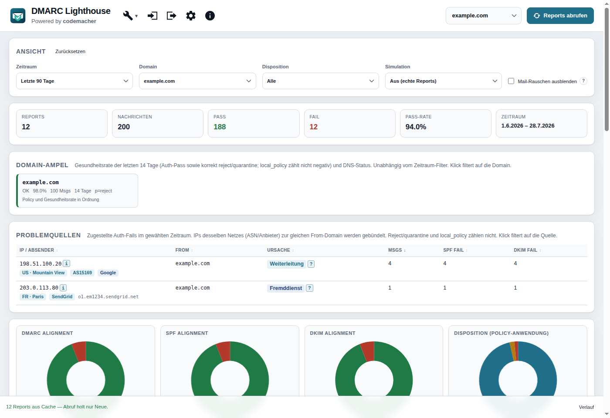
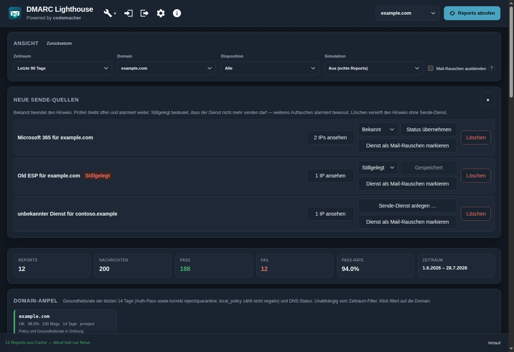
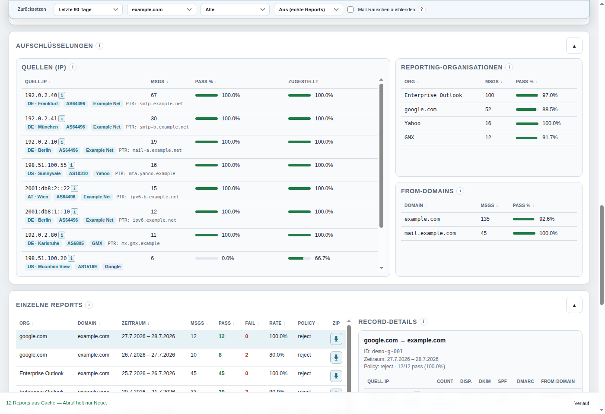
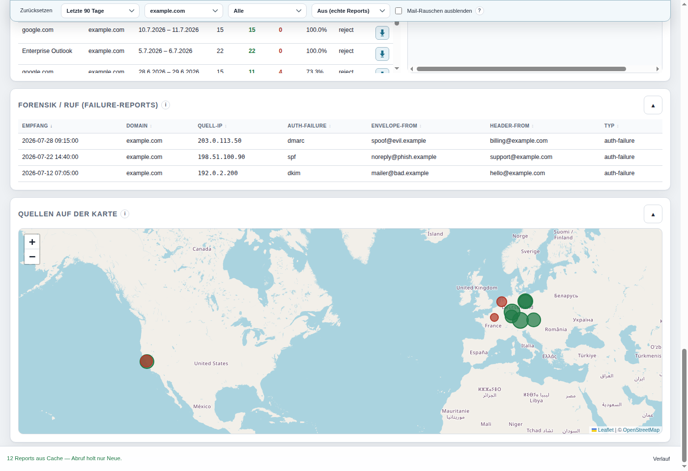
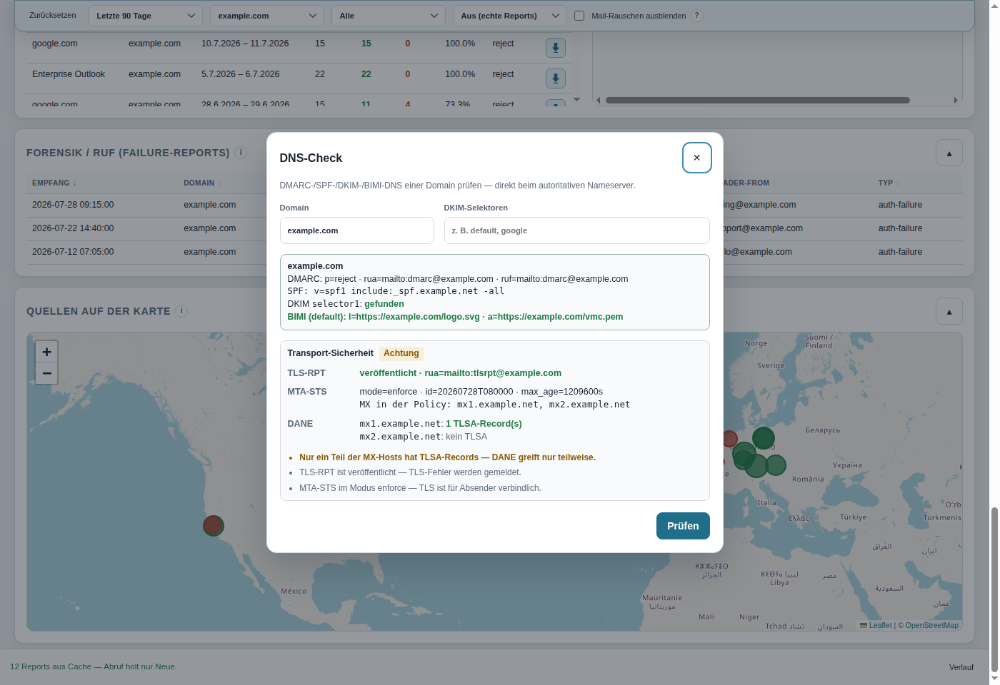
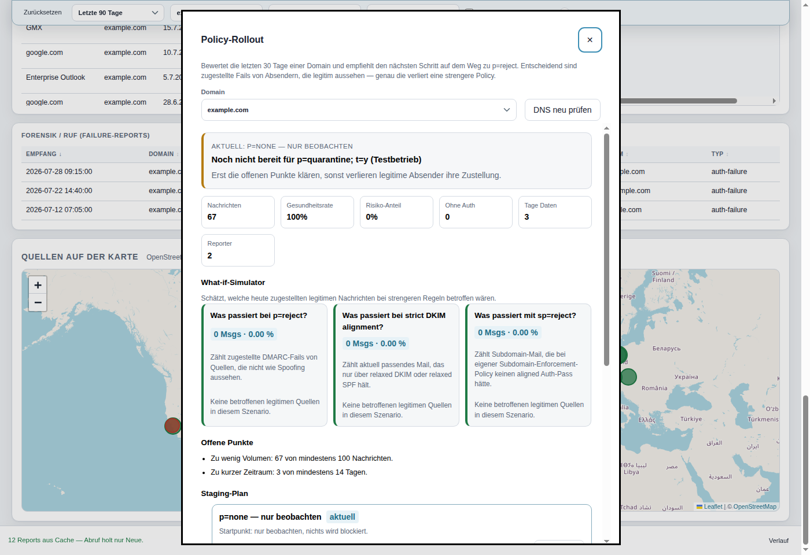
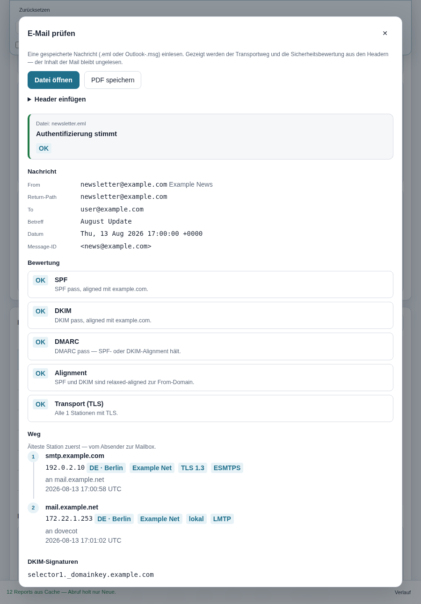
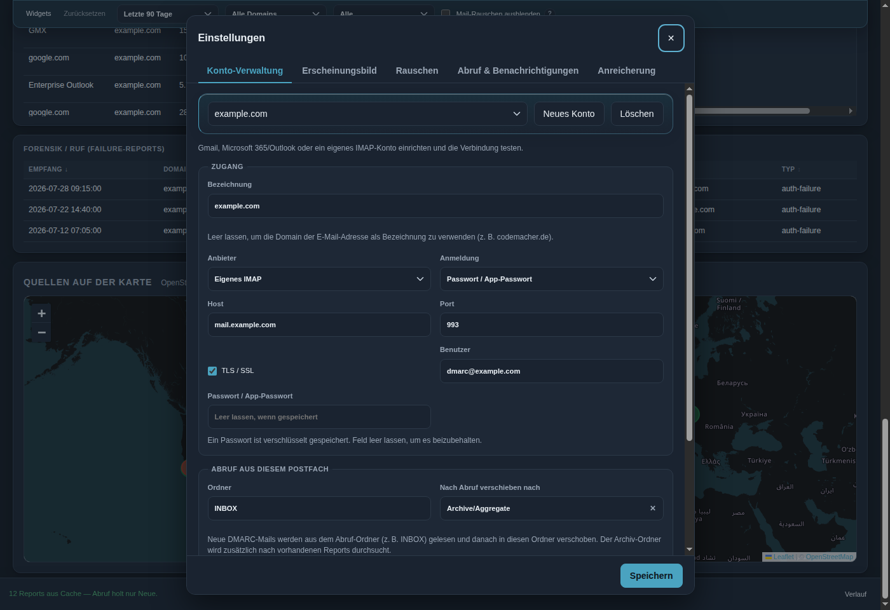

<p align="center">
  
</p>

<h1 align="center">DMARC Lighthouse</h1>

<p align="center">
  <a href="./README.md">English</a> ·
  <a href="./README.de.md">Deutsch</a>
</p>

<p align="center">
  Desktop-App zum Abrufen, Einlesen und Auswerten von DMARC-Aggregate- und Forensik-Reports.<br />
  IMAP-Postfach oder lokale Dateien → KPIs, Alignment-Charts und Detailtabellen — plus Prüfung von Weg und Authentifizierung einer einzelnen E-Mail.
</p>

<p align="center">
  <a href="https://github.com/codemacherUG/dmarc-lighthouse/releases/latest"></a>
  <a href="https://github.com/codemacherUG/dmarc-lighthouse/releases"></a>
  
  
</p>

<p align="center">
  <a href="#funktionen">Funktionen</a> ·
  <a href="#screenshots">Screenshots</a> ·
  <a href="#download--installation">Download</a> ·
  <a href="#nutzung">Nutzung</a> ·
  <a href="#entwicklung">Entwicklung</a>
</p>

---

## Was macht die App?

DMARC-Aggregate-Reports (RUA) und Failure-Reports (RUF) landen oft in einem eigenen Postfach und sind schwer lesbar. **DMARC Lighthouse** holt diese Mails per IMAP (oder per Datei-Import), parst sie lokal und zeigt auf einen Blick:

- wie viele Nachrichten **Pass** bzw. **Fail** hatten und welche **Dispositions** (`none` / `quarantine` / `reject`) angewendet wurden
- ob **DMARC-, SPF- und DKIM-Alignment** stimmen
- welche **Quellen (IPs)**, **From-Domains** und **Reporting-Organisationen** auffällig sind
- wie sich Volumen und Pass-Rate **über die Zeit** entwickeln
- optionale **Alerts** bei steigenden Failures, niedriger Pass-Rate oder neu gesehenen Quell-IPs
- **Forensik / RUF** als bereinigte Tabelle (nur Header — keine Nachrichteninhalte)
- eine gespeicherte **.eml** oder Outlook-**.msg** (oder eingefügte Header): Transportweg, SPF/DKIM/DMARC/TLS/ARC und Gesamturteil

Alles läuft lokal auf dem Rechner: Zugangsdaten und OAuth-Tokens bleiben im Electron-`userData`-Ordner, verschlüsselt mit `safeStorage`. Der Report-Cache nutzt **SQLite**. Es gibt keinen Cloud-Account und keine Telemetrie. Die Oberfläche ist auf **Deutsch** und **Englisch** verfügbar.

---

## Screenshots

### Dashboard

Kennzahlen, Alignment-Charts (inkl. Disposition), Zeitreihe, Filter (inkl. Reject / Nicht reject und optionalem Mailbox-Rauschen) sowie Domain-Ampel:



Dasselbe Dashboard im Dark Mode (Einstellungen → Erscheinungsbild; bei „System“ folgt es dem Betriebssystem):



### Aggregation & Details

Reporting-Organisationen, Quell-IPs (inkl. Reverse-DNS), From-Domains, einzelne Reports und Record-Details — Klick auf eine Tabellenzeile filtert weiter; Report als ZIP herunterladen:



### Quellenkarte

Quell-IPs auf OpenStreetMap (GeoIP-Koordinaten); Klick auf einen Marker filtert nach IP:



### DNS-Check & Transport-Sicherheit

DMARC, SPF, DKIM-Selektoren und BIMI direkt beim autoritativen Nameserver — dazu TLS-RPT, MTA-STS (inkl. Policy-Datei und MX-Abdeckung) und DANE/TLSA der MX-Hosts. Fehlende Einträge lassen sich unter **Tools** geführt erzeugen (DMARC, SPF, TLS-RPT, MTA-STS, BIMI):



### Policy-Rollout

Bewertet die letzten 30 Tage einer Domain, empfiehlt den nächsten Schritt auf dem Weg zu `p=reject` und liefert den Staging-Plan mit fertigen Records zum Kopieren:



### E-Mail prüfen

Unter **Tools → E-Mail prüfen** eine gespeicherte `.eml` oder Outlook-`.msg` öffnen (oder Header einfügen, z. B. Gmail „Original anzeigen“). Gezeigt werden Transportweg, SPF/DKIM/DMARC, TLS je Station, ARC und Gesamturteil. Das Ergebnis lässt sich als **PDF** speichern. Es werden nur Header gelesen — der Inhalt nicht. Interne Stationen (LMTP, Docker-/Privat-IPs) sind als **lokal** markiert, nicht als fehlendes TLS. Bei `.msg` ohne Transport-Header (z. B. ungesendete Entwürfe) fehlen Weg und Auth-Ergebnisse.



### Einstellungen

Mehrere IMAP-Konten, Abruf-/Archiv-Ordner, Auto-Abruf, Alerts, Anreicherung (GeoIP / DNSBL / RDAP), System-Tray, Sprache und Erscheinungsbild (Hell / Dunkel / System):



---

## Funktionen

| Bereich                   | Details                                                                                                                                                                                                                       |
| ------------------------- | ----------------------------------------------------------------------------------------------------------------------------------------------------------------------------------------------------------------------------- |
| **IMAP-Abruf**            | Gmail, Outlook/Microsoft 365 oder beliebiger IMAP-Server; inkrementell über UIDs                                                                                                                                              |
| **Archiv-Ordner**         | Optional „nach Abruf verschieben“ (aus IMAP-Liste wählbar; fehlende Ordner anlegbar); Inbox bleibt überwacht, Reports landen z. B. in `Archive/Aggregate`                                                                     |
| **Anmeldung**             | App-Passwort **oder** OAuth (PKCE) für Gmail und Microsoft 365 IMAP                                                                                                                                                           |
| **Mehrere Konten**        | Beliebig viele IMAP-Konten/Profile mit eigenem Cache; eigene Bezeichnung (Standard: E-Mail-Domain); Umschalten in der Toolbar                                                                                                 |
| **Datei-Import**          | XML, GZ, ZIP, EML/MIME — Dialog oder Drag & Drop; Importe landen im Cache und stehen nach dem Neustart wieder bereit                                                                                                          |
| **Lokaler Cache**         | SQLite für Aggregate- und Forensik-Reports; alte JSON-Caches werden einmalig migriert                                                                                                                                         |
| **Forensik / RUF**        | ARF-Failure-Reports (bereinigte Header); eigene Tabelle in der UI                                                                                                                                                             |
| **Dashboard**             | Reports, Nachrichten, Pass/Fail, Pass-Rate, Zeitraum                                                                                                                                                                          |
| **Charts**                | Doughnut für DMARC-/SPF-/DKIM-Alignment und Disposition (none/quarantine/reject); Volumen & Pass-Rate über Zeit                                                                                                               |
| **Tabellen**              | Organisationen, Quell-IPs, From-Domains, einzelne Reports + Record-Details; Klick auf Zeile filtert; sortierbare Spalten, Tastaturnavigation und Virtualisierung langer Tabellen                                              |
| **IP-Anreicherung**       | Reverse-DNS, erkannter Versanddienst (ESP, Mailbox-Anbieter, SaaS, Gateway, Hosting), Cloud-IP-Ranges (AWS/Google/Cloudflare), GeoIP (GeoLite2 offline + optionaler Online-Fallback), DNSBL/DNSWL, RDAP/WHOIS on-demand       |
| **Fail-Kategorien**       | Problemquellen zeigen die Ursache: Weiterleitung, Fremddienst, Konfiguration, eigener Sender oder ganz ohne Auth                                                                                                              |
| **Policy-Rollout**        | Empfehlung für den nächsten Schritt (`none` → `quarantine` → `reject`) mit Grenzwerten, offenen Punkten und Staging-Plan inkl. kopierbarer Records                                                                            |
| **Quellenkarte**          | OpenStreetMap mit GeoIP-Positionen der Quell-IPs; Marker-Klick filtert nach IP                                                                                                                                                |
| **Domain-Ampel**          | Multi-Domain-Status (Pass-Rate + DMARC/SPF/DKIM-DNS); Klick filtert auf die Domain                                                                                                                                            |
| **Filter**                | Zeitraum (7 / 30 / 90 Tage / Gesamt / benutzerdefiniert), Domain, angewandte Disposition (Reject / Nicht reject) sowie Drill-Down nach Org, Quell-IP und From-Domain                                                          |
| **Mailbox-Rauschen**      | Optionaler Filter für Report-Echo von Gmail, Outlook, Yahoo, iCloud (Anbieter in Einstellungen → Rauschen abwählbar) **und konfigurierbare Empfänger-Scanner** (Vorgabe `cloud-sec-av.com`)                                    |
| **DNS-Check**             | Live-Abfrage von DMARC (`p`, `rua`), SPF, DKIM-Selektoren (automatisch aus den Reports oder manuell) und BIMI (`l`, `a`)                                                                                                      |
| **Record-Wizards**        | DMARC, SPF, TLS-RPT, MTA-STS und BIMI geführt erzeugen; Live-DNS als Vorlage, kopierbare Records (MTA-STS inkl. Policy-Datei)                                                                                                 |
| **Transport-Sicherheit**  | TLS-RPT-Record, MTA-STS-TXT + Policy-Datei (Modus, `max_age`, MX-Abdeckung) und DANE/TLSA pro MX-Host mit Gesamturteil                                                                                                        |
| **E-Mail prüfen**         | `.eml` / `.msg` öffnen oder Header einfügen: Received-Pfad, SPF/DKIM/DMARC/Alignment, TLS vs. lokale Stationen, ARC, Gesamturteil, PDF-Export. Nur lokal; Body ungelesen                                                      |
| **Export**                | Aktuell gefilterte Daten als CSV oder JSON; einzelne Aggregate-Reports als ZIP (XML)                                                                                                                                          |
| **PDF-Managementbericht** | Druckfertiger A4-Bericht (Kennzahlen, Bewertung, Alignment, Verlauf, Domain-Status, Problemquellen) — manuell für die aktuelle Ansicht oder automatisch einmal pro Monat **ein PDF pro Domain**, im Hintergrund aus dem Cache |
| **Auto-Abruf**            | Optionales Intervall über alle Konten + Desktop-Benachrichtigung bei steigenden Failures                                                                                                                                      |
| **Alerts**                | Pass-Rate-Schwelle (7 Tage) und „neue Quelle erkannt“ mit Ignorieren-Liste für bekannte IPs                                                                                                                                   |
| **System-Tray**           | Optional im Hintergrund weiterlaufen; Abruf und Benachrichtigungen auch bei geschlossenem Fenster                                                                                                                             |
| **Autostart**             | Optionaler Start beim System-Login; mit Tray kann die App versteckt im Hintergrund starten                                                                                                                                    |
| **Sprache**               | Deutsch und Englisch umschaltbar (Einstellungen → Erscheinungsbild)                                                                                                                                                           |
| **Erscheinungsbild**      | Hell, Dunkel oder System (folgt dem Betriebssystem)                                                                                                                                                                           |
| **Auto-Update**           | Prüfung auf GitHub Releases (NSIS, AppImage, macOS-ZIP)                                                                                                                                                                       |

---

## Download & Installation

Fertige Builds liegen unter den [GitHub Releases](https://github.com/codemacherUG/dmarc-lighthouse/releases/latest):

| Plattform   | Pakete                       |
| ----------- | ---------------------------- |
| **Windows** | NSIS-Installer, portable EXE |
| **Linux**   | AppImage, `.deb`             |
| **macOS**   | DMG und ZIP (x64 / arm64)    |

Auto-Update greift in gepackten Builds (nicht im Dev-Modus). Portable-EXE und `.deb` werden nicht automatisch aktualisiert — NSIS-Setup, AppImage und macOS-ZIP schon.

---

## Voraussetzungen

- Für den Quellcode-Build: **Node.js 22+** (nutzt eingebautes `node:sqlite`)
- Für Gmail / Outlook: **App-Passwort** oder **OAuth** mit eigenen Client-IDs

### App-Passwörter & IMAP

| Anbieter                    | Host                    | Port        | Hinweis                                                      |
| --------------------------- | ----------------------- | ----------- | ------------------------------------------------------------ |
| **Gmail**                   | `imap.gmail.com`        | `993` (TLS) | App-Passwort oder OAuth mit Scope `https://mail.google.com/` |
| **Outlook / Microsoft 365** | `outlook.office365.com` | `993` (TLS) | App-Passwort oder OAuth mit `IMAP.AccessAsUser.All`          |
| **Custom**                  | beliebig                | z. B. `993` | Benutzer/Passwort; TLS empfohlen                             |

### OAuth einrichten (optional)

1. Öffentliche Desktop-/Native-OAuth-App anlegen (PKCE, ohne Client-Secret):
   - Google Cloud Console → OAuth-Client-Typ „Desktop“
   - Microsoft Entra ID → App-Registrierung → öffentlicher Client, Redirect-URI `http://127.0.0.1:17893/oauth/callback`
2. Unter **Einstellungen → Konto-Verwaltung** Anmeldung **OAuth** wählen und die Client-ID dort eintragen (oder `DMARC_GOOGLE_CLIENT_ID` / `DMARC_MS_CLIENT_ID` setzen). Die Schritte stehen auch unter **Client-ID erstellen**.
3. Konto speichern, dann **Mit Anbieter anmelden**.

---

## Nutzung

1. **Einstellungen** → **Konto-Verwaltung** öffnen, Anbieter/Host sowie App-Passwort oder OAuth setzen und speichern. Bei Bedarf weitere Konten anlegen.
2. Optional eine kurze **Bezeichnung** setzen (leer = Domain der E-Mail-Adresse, z. B. `codemacher.de`). Bei Bedarf **Verbindung testen**. Unter **Abruf & Benachrichtigungen** Auto-Abruf, Alerts, System-Tray und Autostart konfigurieren. Unter **Anreicherung** GeoLite2-Key/Download, optionalen Online-Geo-Fallback, DNSBL, Cloud-Ranges und RDAP einstellen.
3. Im Hauptfenster **Reports abrufen** — oder XML/GZ/ZIP/EML per **Dateien** / Drag & Drop laden. Bei mehreren Konten über den Konto-Filter umschalten.
4. Mit Zeitraum (inkl. benutzerdefiniert Von/Bis), Domain, **Disposition** (Reject / Nicht reject), Domain-Ampel oder per Klick auf Org-/IP-/From-Zeilen (oder Kartenmarker) eingrenzen; optional **Mailbox-Rauschen ausblenden**, um Report-Echo-Hops von Gmail, Outlook, Yahoo und iCloud zu entfernen. Charts, Aggregate-Tabellen, Forensik-/RUF-Tabelle und Quellenkarte prüfen; bei Bedarf exportieren. Über ℹ an einer IP Geo/ASN/DNSBL und RDAP on-demand öffnen; einzelne Reports als ZIP laden.
5. Domains im **DNS-Check** gegenprüfen (Policy `p`, Reporting-URI `rua`, SPF, DKIM-Selektoren aus den Reports oder manuell sowie BIMI).
6. Unter **Tools → E-Mail prüfen** eine `.eml` oder `.msg` laden (auf den Dialog ziehen) oder Header einfügen. Weg, TLS vs. lokale Stationen sowie SPF/DKIM/DMARC/ARC prüfen. Lokaler Versand mit `Authentication-Results: none` ist „unbekannt“, kein Spoofing.
7. Unter **Tools → Policy-Rollout** den nächsten Schritt zu `p=reject` planen: Empfehlung, offene Punkte, zu klärende Absender und Staging-Plan mit kopierbaren Records.
8. Für Berichte an die Leitung im **Export**-Dialog **PDF-Bericht** wählen — oder in den Einstellungen den **Monatsbericht** aktivieren: für jede Domain im abgelaufenen Monat entsteht ein eigenes PDF.

> Tipp: Betreff-Filter erweitern oder leer lassen, wenn RUA und RUF aus demselben Postfach kommen sollen.
>
> Tipp: Abruf-Ordner auf `INBOX` setzen und optional unter **Nach Abruf verschieben nach** einen Archiv-Ordner wählen (z. B. `Archive/Aggregate`). Die IMAP-Ordnerliste erscheint beim Fokus auf die Ordnerfelder; fehlende Ordner lassen sich dort mit **Neuen Ordner anlegen** erstellen. Neue Reports kommen aus der Inbox, werden importiert und verschoben; der Archiv-Ordner wird zusätzlich nach vorhandenen Reports durchsucht.

### Alerts & Hintergrundbetrieb

- **Neue Failures** — Desktop-Benachrichtigung, wenn die Anzahl fehlgeschlagener Nachrichten nach einem Abruf steigt.
- **Pass-Rate-Alarm** — Benachrichtigung, wenn die 7-Tage-Pass-Rate unter die konfigurierte Schwelle fällt (0 = aus).
- **Neue Quelle** — Benachrichtigung bei zuvor ungesehener Quell-IP; bekannte IPs (oder Präfixe wie `66.249.*`) in der Ignorieren-Liste eintragen, um Rauschen zu vermeiden.
- **System-Tray** — App optional bei geschlossenem Fenster weiterlaufen lassen, damit Auto-Abruf und Benachrichtigungen aktiv bleiben. Tray-Menü: anzeigen, jetzt abrufen, beenden.
- **Autostart** — optionaler Start beim System-Login; zusammen mit dem Tray kann die App versteckt im Hintergrund starten.

### Typischer Ablauf

```text
IMAP-Postfach/-Postfächer / lokale Dateien
        │
        ▼
  Parsen (XML / GZ / ZIP / EML)
        │
        ▼
  Lokaler Cache pro Konto (userData)
        │
        ▼
  Analyse → KPIs, Charts, Tabellen
        │
        ├── Filter (Zeitraum, Domain, Disposition, Drill-Down Org / IP / From)
        ├── DNS-Check (DMARC / SPF / DKIM / BIMI)
        ├── Record-Wizards (DMARC / SPF / TLS-RPT / MTA-STS / BIMI)
        ├── E-Mail prüfen (.eml / .msg / Einfügen: Weg, TLS, SPF/DKIM/DMARC/ARC)
        ├── Policy-Rollout (nächster Schritt + Staging-Plan)
        ├── Alerts (Failures / Pass-Rate / neue Quellen)
        └── Export (CSV / JSON / PDF-Managementbericht, monatlich automatisch)
```

---

## Entwicklung

```bash
npm install
npm run dev
```

Unit-Tests (Filter-/Aggregationslogik):

```bash
npm test
```

Produktion lokal:

```bash
npm run build
npm start
```

Plattform-Pakete:

```bash
npm run build:linux   # AppImage + deb
npm run build:win     # NSIS + portable
npm run build:mac     # DMG/ZIP (nur auf macOS)
```

README-Screenshots neu erzeugen (Demo-Daten, Deutsch und Englisch, ohne echte Zugangsdaten):

```bash
npm run screenshots
```

GitHub Release (alle Plattformen via Actions): Tag wie `v1.0.7` pushen oder Workflow **Release** manuell starten.

### Auto-Update-Vertrauen

Binaries kommen von GitHub Releases; vor der Installation verlangt die App zusätzlich ein **Ed25519-signiertes Manifest** unter `https://apps.codemacher.de/dmarc-lighthouse/updates/{version}.json` (+ `.sig`). Ein kompromittiertes GitHub-Release allein reicht nicht.

Das Release-CI signiert mit Secret `UPDATE_SIGNING_PRIVATE_KEY` (PKCS#8-PEM). Die Manifeste liegen **nicht** im GitHub-Release, sondern nur auf dem Trust-Host (bzw. kurz als Actions-Artifact `update-manifests` für den lokalen Deploy).

Komplett-Release (ein Schritt: Tag → CI → Manifest auf apps.codemacher.de):

```bash
cp scripts/update-keys.sh.template scripts/update-keys.sh   # einmalig, gitignored
# Deploy-Env in update-keys.sh eintragen
npm run release
```

`update-keys.sh` liefert nur die SSH-/Pfad-Daten; alles andere macht `scripts/release.sh`. Optional: CI-Deploy über Secrets `UPDATE_MANIFEST_DEPLOY_*`. Schlüssel: `npm run update:keys` → Public Key in `src/main/update-trust.ts`.

### Technik

- **Electron** + **electron-vite** + **TypeScript**
- IMAP: [`imapflow`](https://github.com/postalsys/imapflow)
- Parsing: [`@koduhai/dmarc-parser`](https://www.npmjs.com/package/@koduhai/dmarc-parser)
- Charts: [Chart.js](https://www.chartjs.org/)
- GeoIP: [`maxmind`](https://www.npmjs.com/package/maxmind) (GeoLite2) + optionaler Online-Fallback
- Updates: [`electron-updater`](https://www.electron.build/auto-update) über GitHub Releases + signierte Manifeste auf apps.codemacher.de
- Tests: [Vitest](https://vitest.dev/)

---

## Hinweise & Grenzen

- Forensik-/RUF-Zeilen zeigen nur bereinigte Header — Nachrichteninhalte werden weder gespeichert noch angezeigt. Dasselbe gilt für **E-Mail prüfen**: es werden nur Header gelesen.
- Outlook-`.msg` ohne Internet-Transport-Header (typisch bei Entwürfen) liefert nur Absender/Betreff, keinen Received-Pfad.
- Nachrichten ohne gültigen DMARC-Anhang werden übersprungen und gezählt.
- Einstellungen und Report-Caches liegen unter dem Electron-`userData`-Pfad (nicht im Repo); jedes IMAP-Konto hat einen eigenen Cache.
- Cache leeren: Einstellungen → Konto-Verwaltung → **Cache dieses Kontos leeren** (nächster Abruf holt für dieses Konto wieder alles).
- Optional können abgerufene Nachrichten als gelesen markiert (`\Seen`) und/oder nach dem Import in einen Archiv-Ordner verschoben werden.
- Mit aktivem System-Tray blendet das Schließen des Fensters die App nur aus — vollständig beenden über **Beenden** im Tray-Menü. Das Tray-Icon zeigt eine Markierung, wenn neue Reports eingegangen sind, während das Fenster verborgen war; beim Öffnen verschwindet sie wieder.
- Bestehende Einzelkonto-Einstellungen älterer Versionen werden automatisch ins Multi-Konto-Format migriert.

---

## Lizenz & Attributionen

DMARC Lighthouse steht unter der [MIT-Lizenz](LICENSE). Lizenztexte gebündelter Abhängigkeiten stehen in [THIRD_PARTY_NOTICES.txt](THIRD_PARTY_NOTICES.txt) (auch unter **Über → Open-Source-Lizenzen anzeigen**). Electron-/Chromium-Hinweise liegen der Paketierung bei.

Optionales Offline-GeoIP nutzt MaxMind GeoLite2 (Download durch den Nutzer mit MaxMind-License-Key):

> This product includes GeoLite2 Data created by MaxMind, available from https://www.maxmind.com

Notices nach Dependency-Änderungen neu erzeugen: `npm run licenses:generate`.

---

## Autor

**codemacher UG (haftungsbeschränkt)** · [codemacher.de](https://codemacher.de/)

Issues und Pull Requests gerne über [GitHub](https://github.com/codemacherUG/dmarc-lighthouse).
