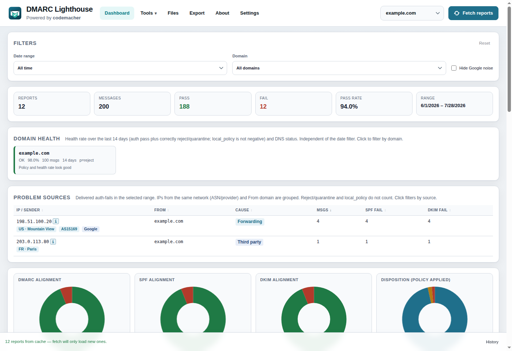
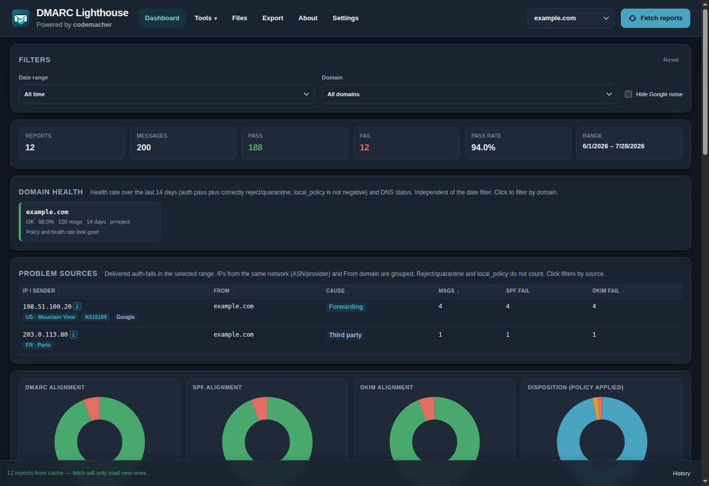
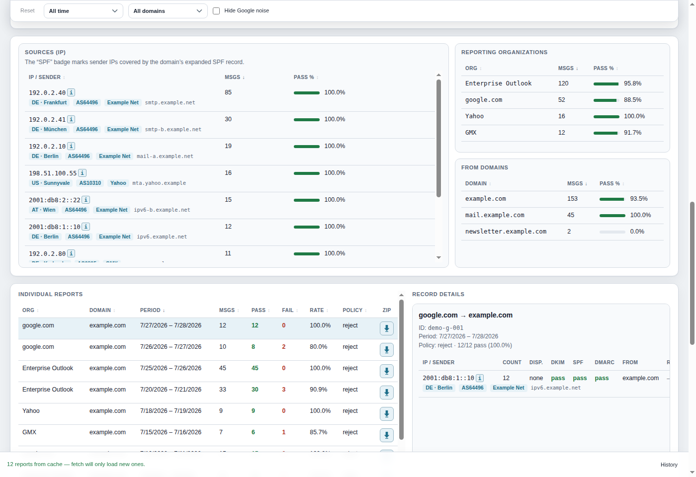
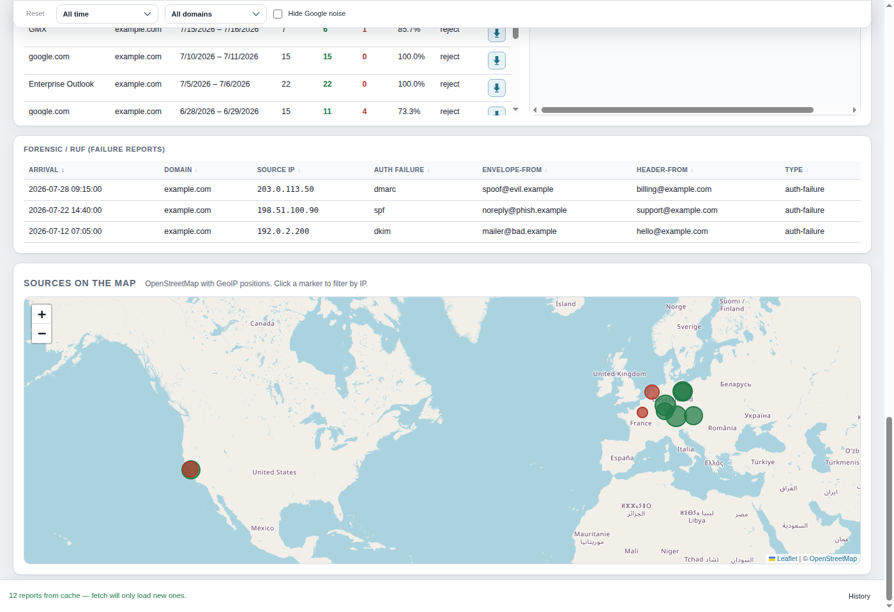
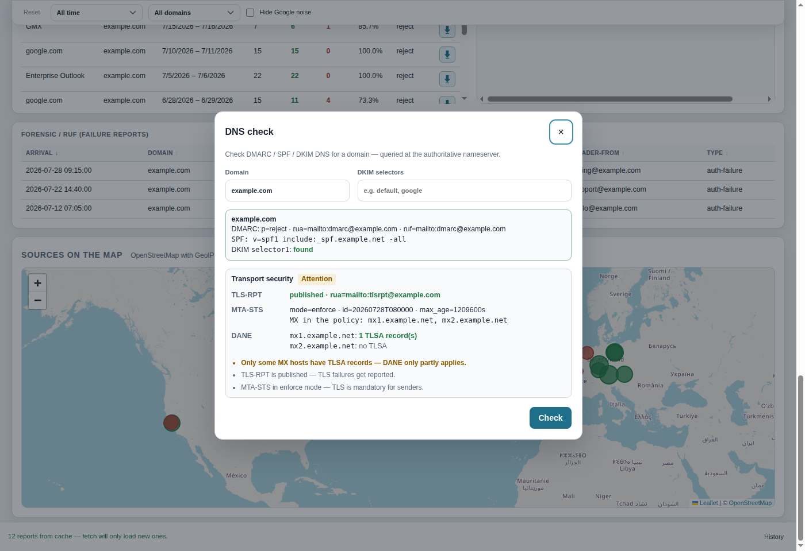
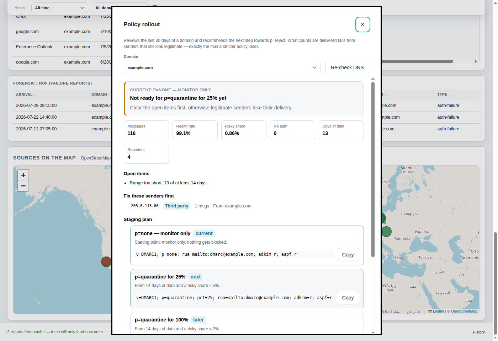
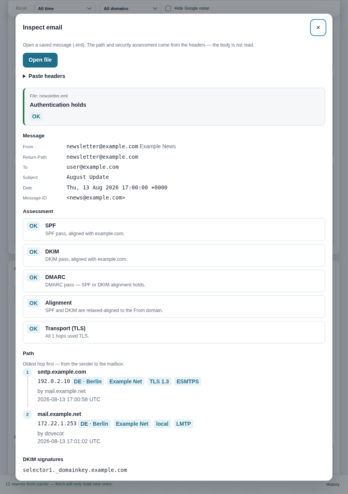
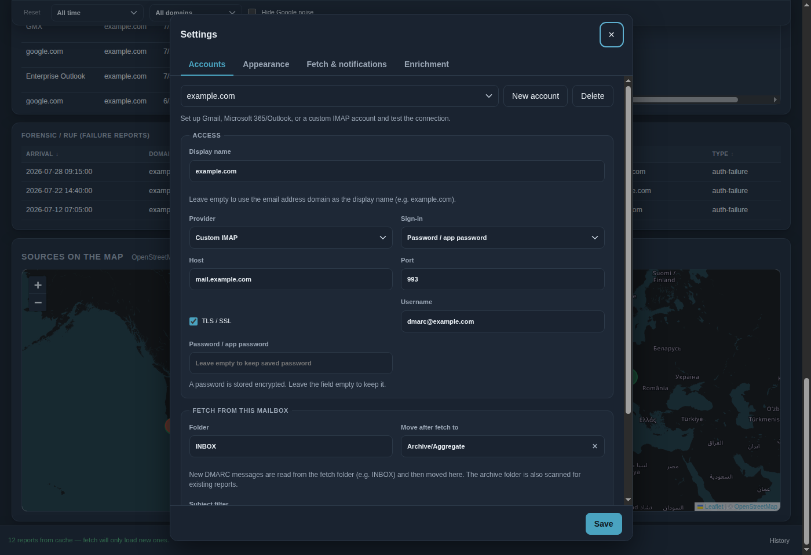

<p align="center">
  
</p>

<h1 align="center">DMARC Lighthouse</h1>

<p align="center">
  <a href="./README.md">English</a> ·
  <a href="./README.de.md">Deutsch</a>
</p>

<p align="center">
  Desktop app for fetching, importing, and analyzing DMARC aggregate and forensic reports.<br />
  IMAP mailbox or local files → KPIs, alignment charts, and detail tables — plus inspecting a single email’s path and authentication.
</p>

<p align="center">
  <a href="https://github.com/codemacherUG/dmarc-lighthouse/releases/latest"></a>
  <a href="https://github.com/codemacherUG/dmarc-lighthouse/releases"></a>
  
  
</p>

<p align="center">
  <a href="#features">Features</a> ·
  <a href="#screenshots">Screenshots</a> ·
  <a href="#download--installation">Download</a> ·
  <a href="#usage">Usage</a> ·
  <a href="#development">Development</a>
</p>

---

## What does the app do?

DMARC aggregate reports (RUA) and failure reports (RUF) often land in a dedicated mailbox and are hard to read. **DMARC Lighthouse** fetches these emails via IMAP (or via file import), parses them locally, and shows at a glance:

- how many messages **passed** or **failed**, and which **dispositions** (`none` / `quarantine` / `reject`) were applied
- whether **DMARC, SPF, and DKIM alignment** hold
- which **sources (IPs)**, **From domains**, and **reporting organizations** stand out
- how volume and pass rate evolve **over time**
- optional **alerts** for rising failures, a low pass rate, or newly seen source IPs
- **forensic / RUF** failure reports as a sanitized table (headers only — no message bodies)
- a saved **.eml** (or pasted headers): hop path, SPF/DKIM/DMARC/TLS/ARC, and an overall verdict

Everything runs locally on your machine: credentials and OAuth tokens stay in the Electron `userData` folder, encrypted with `safeStorage`. Report caches use **SQLite**. There is no cloud account and no telemetry. The UI is available in **German** and **English**.

---

## Screenshots

### Dashboard

KPIs, alignment charts (including disposition), time series, filters (including optional Google-noise filter), and domain-health tiles:



Same dashboard in dark mode (Settings → Appearance; follows the OS when set to System):



### Aggregation & details

Reporting organizations, source IPs (including reverse DNS), From domains, individual reports and record details — click a table row to drill down; download a report as ZIP:



### Source map

Source IPs on OpenStreetMap (GeoIP coordinates); click a marker to filter by IP:



### DNS check & transport security

DMARC, SPF, and DKIM selectors straight from the authoritative nameserver — plus TLS-RPT, MTA-STS (including the policy file and MX coverage), and DANE/TLSA of the MX hosts:



### Policy rollout

Reviews the last 30 days of a domain, recommends the next step towards `p=reject`, and lays out the staging plan with ready-to-copy records:



### Email inspection

Under **Tools → Inspect email**, open a saved `.eml` (or paste headers, e.g. Gmail “Show original”). The app shows the hop path, SPF/DKIM/DMARC, TLS per hop, ARC, and an overall verdict. Only headers are read — the body is not. Internal hops (LMTP, Docker/private IPs) are marked **local**, not as missing TLS. Outlook `.msg` is not supported (save as `.eml`).



### Settings

Multiple IMAP accounts, fetch/archive folders, auto-fetch, alerts, enrichment (GeoIP / DNSBL / RDAP), system tray, UI language, and appearance (light / dark / system):



---

## Features

| Area | Details |
| --- | --- |
| **IMAP fetch** | Gmail, Outlook/Microsoft 365, or any IMAP server; incremental via UIDs |
| **Archive folder** | Optional “move after fetch” folder (selectable from IMAP list; create missing folders); inbox stays monitored while reports land in e.g. `Archive/Aggregate` |
| **Auth** | App password **or** OAuth (PKCE) for Gmail and Microsoft 365 IMAP |
| **Multiple accounts** | Any number of IMAP accounts/profiles with separate caches; custom display name (default: email domain); switch via toolbar |
| **File import** | XML, GZ, ZIP, EML/MIME — dialog or drag & drop; imports go into the cache and are still there after a restart |
| **Local cache** | SQLite store for aggregate + forensic reports; legacy JSON caches are migrated once |
| **Forensic / RUF** | ARF failure reports (sanitized headers); separate table in the UI |
| **Dashboard** | Reports, messages, pass/fail, pass rate, date range |
| **Charts** | Doughnuts for DMARC/SPF/DKIM alignment and disposition (none/quarantine/reject); volume & pass rate over time |
| **Tables** | Organizations, source IPs, From domains, individual reports + record details; click a row to filter; sortable columns, keyboard navigation, and virtualized long tables |
| **IP enrichment** | Reverse DNS, identified sending service (ESP, mailbox provider, SaaS, gateway, hosting), cloud IP ranges (AWS/Google/Cloudflare), GeoIP (GeoLite2 offline + optional online fallback), DNSBL/DNSWL, on-demand RDAP/WHOIS |
| **Failure categories** | Problem sources name the cause: forwarding, third party, configuration, own sender, or no auth at all |
| **Policy rollout** | Recommends the next step (`none` → `quarantine` → `reject`) with thresholds, open items, and a staging plan of ready-to-copy records |
| **Source map** | OpenStreetMap with GeoIP positions of source IPs; marker click drills down by IP |
| **Domain health** | Multi-domain traffic-light (pass rate + DMARC/SPF/DKIM DNS status); click to filter |
| **Filters** | Date range (7 / 30 / 90 days / all / custom), domain, plus drill-down by org, source IP, and From domain |
| **Google noise filter** | Optional, persisted filter that hides Google forwarding / report-echo rows (Google IP + SPF fail + DKIM pass + DMARC pass) |
| **DNS check** | Live lookup of DMARC (`p`, `rua`), SPF, and DKIM selectors (auto-collected from reports or manual) |
| **Transport security** | TLS-RPT record, MTA-STS TXT + policy file (mode, `max_age`, MX coverage), and DANE/TLSA per MX host with an overall verdict |
| **Email inspection** | Open an `.eml` or paste headers: Received path, SPF/DKIM/DMARC/alignment, TLS vs local hops, ARC, overall verdict. Local only; body unread. `.msg` not supported |
| **Export** | Currently filtered data as CSV or JSON; single aggregate reports as ZIP (XML) |
| **PDF management report** | Print-ready A4 report (key figures, assessment, alignment, trend, domain status, problem sources) — on demand for the current view, or automatically once a month **one PDF per domain**, built in the background from the cache |
| **Auto-fetch** | Optional interval across all accounts + desktop notification when failures increase |
| **Alerts** | Pass-rate threshold (7 days) and "new source detected" with an ignore list for known IPs |
| **System tray** | Optionally keep running in the background; fetching and notifications continue with the window closed |
| **Autostart** | Optional launch at system login; with tray enabled the app can start hidden in the background |
| **Language** | Switchable German and English UI (Settings → Appearance) |
| **Appearance** | Light, dark, or follow the operating system |
| **Auto-update** | Checks GitHub Releases (NSIS, AppImage, macOS ZIP) |

---

## Download & installation

Ready-made builds are available under [GitHub Releases](https://github.com/codemacherUG/dmarc-lighthouse/releases/latest):

| Platform | Packages |
| --- | --- |
| **Windows** | NSIS installer, portable EXE |
| **Linux** | AppImage, `.deb` |
| **macOS** | DMG and ZIP (x64 / arm64) |

Auto-update works in packaged builds (not in dev mode). Portable EXE and `.deb` are not updated automatically — NSIS setup, AppImage, and macOS ZIP are.

---

## Requirements

- For building from source: **Node.js 22+** (uses built-in `node:sqlite`)
- For Gmail / Outlook: an **app password**, or **OAuth** with your own client IDs

### App passwords & IMAP

| Provider | Host | Port | Notes |
| --- | --- | --- | --- |
| **Gmail** | `imap.gmail.com` | `993` (TLS) | App password, or OAuth with scope `https://mail.google.com/` |
| **Outlook / Microsoft 365** | `outlook.office365.com` | `993` (TLS) | App password, or OAuth with `IMAP.AccessAsUser.All` |
| **Custom** | any | e.g. `993` | Username/password; TLS recommended |

### OAuth setup (optional)

1. Create a **public desktop / native** OAuth client (PKCE, no client secret):
   - Google Cloud Console → OAuth client type “Desktop”
   - Microsoft Entra ID → App registration → public client, redirect URI `http://127.0.0.1:17893/oauth/callback`
2. Under **Settings → Accounts**, choose **OAuth** and paste the client ID there (or set `DMARC_GOOGLE_CLIENT_ID` / `DMARC_MS_CLIENT_ID`). The same steps are under **Create a client ID**.
3. Save the account, then **Sign in with provider**.

---

## Usage

1. Open **Settings** → **Accounts**, set provider/host and either an app password or OAuth, then save. Add further accounts if needed.
2. Optionally set a short **display name** (empty = email domain, e.g. `codemacher.de`). **Test connection** if needed. Under **Fetch & notifications**, configure auto-fetch, alerts, system tray, and autostart. Under **Enrichment**, configure GeoLite2 license key / download, optional online Geo-IP fallback, DNSBL, cloud ranges, and RDAP.
3. In the main window, **Fetch reports** — or load XML/GZ/ZIP/EML via **Files** / drag & drop. With multiple accounts, switch via the account filter.
4. Narrow with date range (including custom From/To), domain, domain-health tiles, or by clicking a row in the org / IP / From tables (or a map marker); optionally enable **Hide Google noise** to drop Google report-echo hops. Review charts, aggregate tables, the forensic/RUF table, and the source map; export if needed. Open IP details (ℹ) for Geo/ASN/DNSBL and on-demand RDAP; download individual reports as ZIP.
5. Cross-check domains in the **DNS check** (policy `p`, reporting URI `rua`, SPF, and DKIM selectors from the reports or entered manually).
6. Open **Tools → Inspect email** to load an `.eml` (drag onto the dialog) or paste headers. Review the path, TLS vs local hops, and SPF/DKIM/DMARC/ARC. Local delivery with `Authentication-Results: none` is “unknown”, not a spoof.
7. Plan the next step towards `p=reject` under **Tools → Policy rollout**: recommendation, open items, senders to fix, and a staging plan of ready-to-copy records.
8. For management reporting, pick **PDF report** in the **Export** dialog — or enable the **monthly report** in the settings: each domain in the finished month gets its own PDF.

> Tip: Broaden the subject filter (or leave it empty) if you want both RUA and RUF messages from the same mailbox.
>
> Tip: Set the fetch folder to `INBOX` and optionally **Move after fetch to** an archive folder (e.g. `Archive/Aggregate`). The IMAP folder list appears when you focus the folder fields; missing folders can be created there via **Create new folder**. New reports are read from the inbox, imported, then moved; the archive folder is also scanned for existing reports.

### Alerts & background mode

- **New failures** — desktop notification when the failing message count rises after a fetch.
- **Pass-rate alert** — notify when the 7-day pass rate falls below a configured threshold (0 = off).
- **New source** — notify when a previously unseen source IP appears; list known IPs (or prefixes like `66.249.*`) under ignored sources to suppress noise.
- **System tray** — optionally keep the app running when the window is closed so auto-fetch and notifications continue. Tray menu: show window, fetch now, quit.
- **Autostart** — optionally launch at system login; combined with the tray the app can start hidden in the background.

### Typical flow

```text
IMAP mailbox(es) / local files
        │
        ▼
  Parse (XML / GZ / ZIP / EML)
        │
        ▼
  Local cache per account (userData)
        │
        ▼
  Analysis → KPIs, charts, tables
        │
        ├── Filters (date range, domain, org / IP / From drill-down)
        ├── DNS check (DMARC / SPF / DKIM)
        ├── Email inspection (.eml / paste: path, TLS, SPF/DKIM/DMARC/ARC)
        ├── Policy rollout (next step + staging plan)
        ├── Alerts (failures / pass rate / new sources)
        └── Export (CSV / JSON / PDF management report, monthly on schedule)
```

---

## Development

```bash
npm install
npm run dev
```

Run unit tests (filter / aggregation logic):

```bash
npm test
```

Production build locally:

```bash
npm run build
npm start
```

Platform packages:

```bash
npm run build:linux   # AppImage + deb
npm run build:win     # NSIS + portable
npm run build:mac     # DMG/ZIP (macOS only)
```

Refresh README screenshots (demo data, German + English, no real credentials):

```bash
npm run screenshots
```

GitHub release (all platforms via Actions): push a tag like `v1.0.7` or start the **Release** workflow manually.

### Auto-update trust

Binaries are fetched from GitHub Releases; before install the app also requires an **Ed25519-signed manifest** from `https://apps.codemacher.de/dmarc-lighthouse/updates/{version}.json` (+ `.sig`). A compromised GitHub release alone is not enough.

Release CI signs with secret `UPDATE_SIGNING_PRIVATE_KEY` (PKCS#8 PEM). Manifests are **not** attached to the GitHub Release — only published to the trust host (and briefly as the Actions artifact `update-manifests` for local deploy).

Full release (one step: tag → CI → manifest on apps.codemacher.de):

```bash
cp scripts/update-keys.sh.template scripts/update-keys.sh   # once, gitignored
# fill deploy env in update-keys.sh
npm run release
```

`update-keys.sh` only holds SSH/path credentials; `scripts/release.sh` does the rest. Optional CI deploy via `UPDATE_MANIFEST_DEPLOY_*` secrets. Keygen: `npm run update:keys` → public key in `src/main/update-trust.ts`.

### Stack

- **Electron** + **electron-vite** + **TypeScript**
- IMAP: [`imapflow`](https://github.com/postalsys/imapflow)
- Parsing: [`@koduhai/dmarc-parser`](https://www.npmjs.com/package/@koduhai/dmarc-parser)
- Charts: [Chart.js](https://www.chartjs.org/)
- GeoIP: [`maxmind`](https://www.npmjs.com/package/maxmind) (GeoLite2) + optional online fallback
- Updates: [`electron-updater`](https://www.electron.build/auto-update) via GitHub Releases + signed manifests on apps.codemacher.de
- Tests: [Vitest](https://vitest.dev/)

---

## Notes & limitations

- Forensic/RUF rows show sanitized headers only — message bodies are never stored or displayed. The same applies to **Inspect email**: only headers are parsed.
- Outlook `.msg` is not supported for inspection; save the message as `.eml`.
- Messages without a valid DMARC attachment are skipped and counted.
- Settings and report caches live under the Electron `userData` path (not in the repo); each IMAP account has its own cache.
- Clear cache: Settings → Accounts → **Clear this account’s cache** (the next fetch will retrieve everything again for that account).
- Optionally, fetched messages can be marked as read (`\Seen`) and/or moved to an archive folder after import.
- With system tray enabled, closing the window hides the app instead of quitting — use **Quit** from the tray menu to exit fully. The tray icon shows a marker when new reports arrived while the window was hidden; opening the window clears it.
- Existing single-account settings from older versions are migrated automatically to the multi-account format.

---

## License & attributions

DMARC Lighthouse is released under the [MIT License](LICENSE). Bundled dependency license texts are listed in [THIRD_PARTY_NOTICES.txt](THIRD_PARTY_NOTICES.txt) (also via **About → View open-source licenses**). Electron/Chromium notices ship with the packaged app.

Optional offline GeoIP uses MaxMind GeoLite2 (downloaded by the user with a MaxMind license key):

> This product includes GeoLite2 Data created by MaxMind, available from https://www.maxmind.com

Regenerate the notices file after dependency changes: `npm run licenses:generate`.

---

## Author

**codemacher UG (haftungsbeschränkt)** · [codemacher.de](https://codemacher.de/)

Issues and pull requests welcome on [GitHub](https://github.com/codemacherUG/dmarc-lighthouse).
